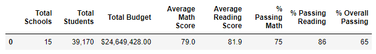
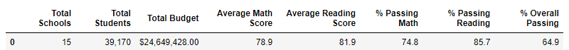
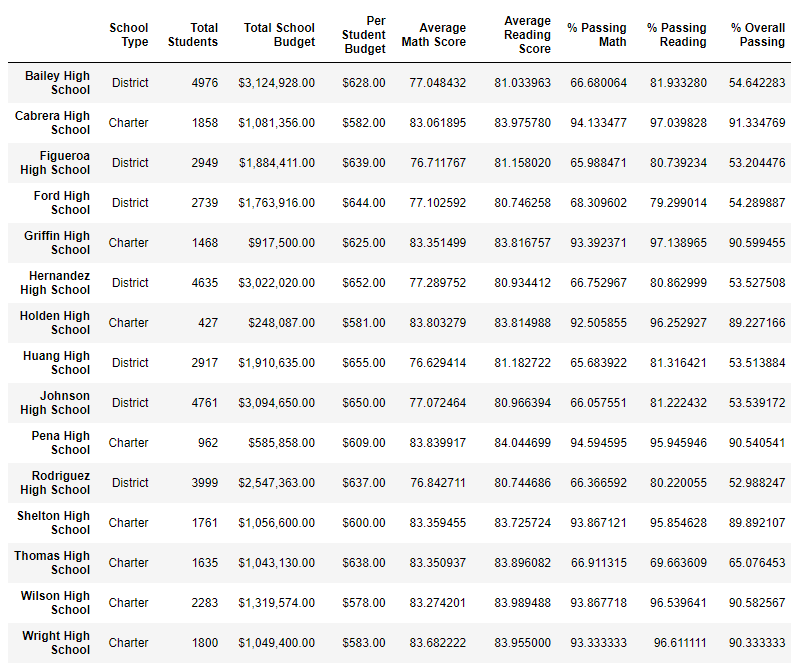
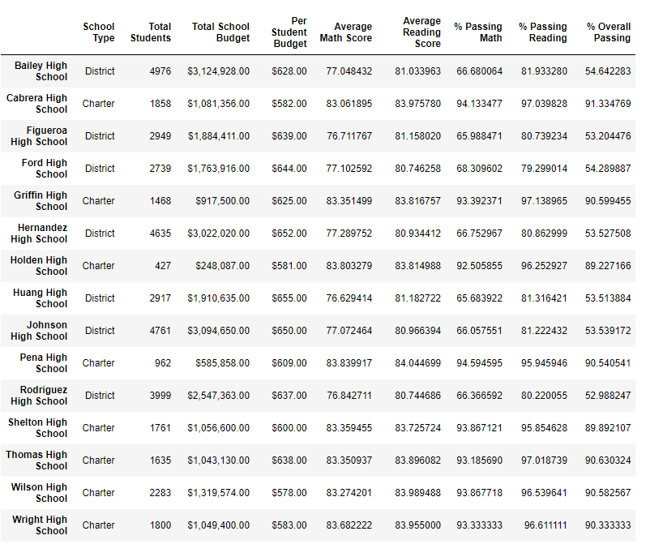
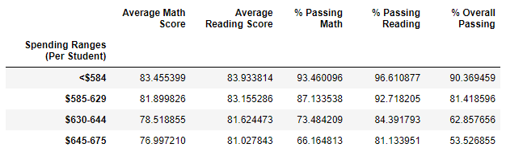
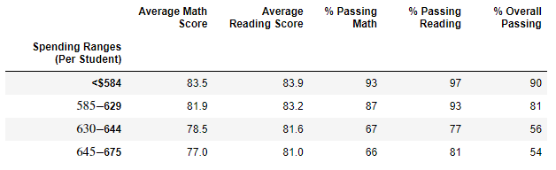

# School_District_Analysis
## Purpose
There was evidence of academic dishonesty in the school district. Maria and her supervisors
requested the removal of the math and reading scores among the 9th graders from Thomas High School.
Then repeat the school district analysis to compare the two results.

## Analysis
### Dependencies
There are two denpendencies for our program.
- We use pandas, a software library written for Python to manipulate and create DataFrames to analyze our data.
- We also use numpy to help replace the 9th grader grades in Thomas High School

The school district provided us two files within the Resources folder, namely schools_complete_csv and students_complete.csv
for our analysis.

## Result

**Disclaimer** All values are rounded to the nearest tenth decimal.

### District Summary Analysis

**The original District Summary including the 9th graders from Thomas High School**

**After the removal of the 9th graders from Thomas High School**

Looking a the district summary upon the removal of the reported data:
- Total Schools is unaffected
- Total Students is unaffected
- Total budget does not change
- __Average Math Score__ fell by 0.1%
- __Average Reading Score__ does not seem to have changed.
- __% Passing Math__dropped 0.2%
- __% Passing Reading__dropped by 0.3%.
- The __% Overall Passing__ dropped by 0.1%.

### School Summary Analysis

**Disclaimer - All values are rounded to the nearest tenth.

**__The unaltered School Summary including the 9th graders from Thomas High School__**

For the new school summary, I created a new DataFrame for 10th to 12th graders in Thomas High School and calculated
new percentages of students that passed 70 on math, reading, and both based on the grades of 10th-12th graders. Then I
updated the school_summary_df by replacing the __% Passing Math__, __% Passing Reading__, and __% Overall Passing__ that
we just calculated for the 10th to 12th graders in Thomas High School. Giving the following result:

**__The altered School Summary excluding the 9th graders from Thomas High School__**

Taking a quick look a the __% Passing Math__, __% Passing Reading__, and __% Overall Passing__ differences. We notice the following for Thomas High School:

**Disclaimer - All values are rounded to the nearest tenth.

- % Passing Math increased from 66.9% to 93.2
- % Passing Reading increased from 69.7% to 97.0%
- % Overall Passing increased from 65.1% to 90.6%

## Summary
The result of replaceing the 9th graders math and reading score and updating the average of passing grades to the averge of 10th-12th graders' passing grades changed
the outcome of the "High and Low Performing School. Thomas High School became the Top 2nd School when we filter by the highest __% Overall Passing__.
-------------------------------------------
The math and reading scores by grade did not change much. The only difference are the values we assigned to 9th graders for Thomas High Schools for, which should be nan for both charts(below):

\
-------------------------------------------
The only noticible change when we take a look at the spending summary is the change in % Passing Math, % Passing Reading, and % % Overall Passing between the Spending Ranges of $630 tp $644.

- % Passing Math decreased from 73% to 67% between the Spending Ranges of $630-$644.
- % Passing Reading decreased from 84% to 62% between the Spending Ranges of $630-$644.
- % Overall Passing decreased from 62% to 56% between the Spending Ranges of $630-$644.

There was no change to the Scores by School Size when we replaced the averages using the average grades of 10th-12th graders from Thomas High School in the per_school_sumamry_df.

There was no change to the Scores by school type when we replaced the averages using the average grades of 10th-12th graders from Thomas High School in the per_school_sumamry_df.

